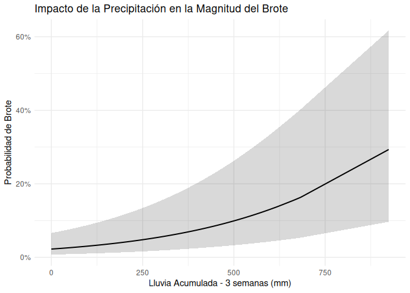
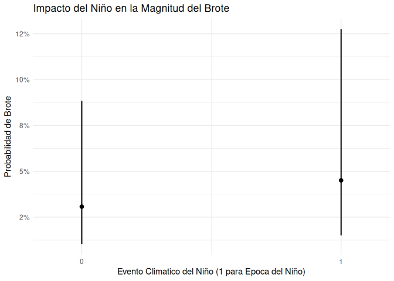
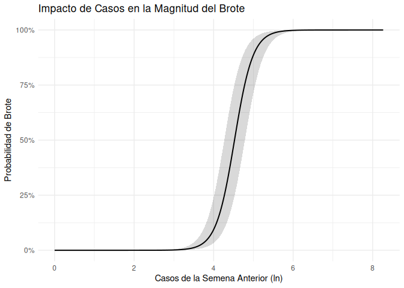
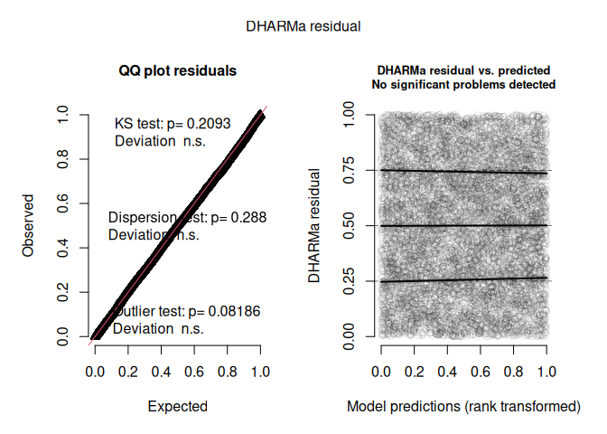
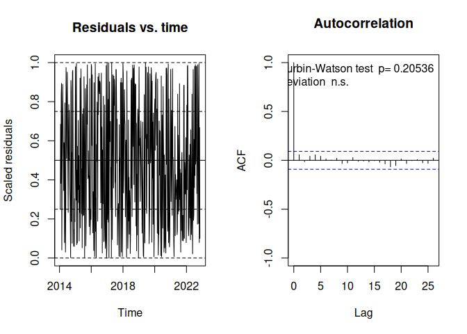

Interpretacion del Modelo de Dengue
================
2026-10-04

### Cargar CSV

``` r
dengue_etapa1 <- readr::read_csv("../Data/Csv/Etapas_dengue.csv") %>%
  dplyr::mutate(tiempo_factor = as.factor(calendar_start_date),
                Niño = as.factor(Niño))
```

    ## Rows: 8244 Columns: 15
    ## ── Column specification ────────────────────────────────────────────────────────
    ## Delimiter: ","
    ## chr   (1): DEPARTAMENTO
    ## dbl  (11): Year, dengue_total, Temperature, Rain, Niño, Rain_acc3, casos_sem...
    ## date  (3): calendar_start_date, calendar_end_date, tiempo_factor
    ## 
    ## ℹ Use `spec()` to retrieve the full column specification for this data.
    ## ℹ Specify the column types or set `show_col_types = FALSE` to quiet this message.

``` r
dplyr::glimpse(dengue_etapa1)
```

    ## Rows: 8,244
    ## Columns: 15
    ## $ DEPARTAMENTO             <chr> "BILWI", "BILWI", "BILWI", "BILWI", "BILWI", …
    ## $ calendar_start_date      <date> 2014-01-19, 2014-01-26, 2014-02-02, 2014-02-…
    ## $ calendar_end_date        <date> 2014-01-25, 2014-02-01, 2014-02-08, 2014-02-…
    ## $ Year                     <dbl> 2014, 2014, 2014, 2014, 2014, 2014, 2014, 201…
    ## $ dengue_total             <dbl> 0, 1, 2, 3, 6, 6, 14, 9, 8, 3, 1, 6, 1, 3, 4,…
    ## $ Temperature              <dbl> 23.94286, 24.65714, 25.04286, 25.28571, 25.27…
    ## $ Rain                     <dbl> 18.8, 8.6, 6.0, 9.3, 11.0, 3.2, 6.8, 5.6, 2.5…
    ## $ Niño                     <fct> 0, 0, 0, 0, 0, 0, 0, 0, 0, 0, 0, 0, 0, 0, 0, …
    ## $ Rain_acc3                <dbl> 53.3, 38.5, 33.4, 23.9, 26.3, 23.5, 21.0, 15.…
    ## $ casos_semana_anterior    <dbl> 0, 0, 1, 2, 3, 6, 6, 14, 9, 8, 3, 1, 6, 1, 3,…
    ## $ ln_dengue                <dbl> 0.0000000, 0.6931472, 1.0986123, 1.3862944, 1…
    ## $ ln_casos_semana_anterior <dbl> 0.0000000, 0.0000000, 0.6931472, 1.0986123, 1…
    ## $ tiempo_factor            <fct> 2014-01-19, 2014-01-26, 2014-02-02, 2014-02-0…
    ## $ threshold                <dbl> 24, 24, 24, 24, 24, 24, 24, 24, 24, 24, 24, 2…
    ## $ is_brote                 <dbl> 0, 0, 0, 0, 0, 0, 0, 0, 0, 0, 0, 0, 0, 0, 0, …

# Resumen del modelo

La definición del evento de brote `is_brote` se estableció aislando las
semanas epidemiológicas donde los casos superan el percentil 75 de la
distribución histórica. Esta decisión metodológica se fundamenta en la
técnica del Canal Endémico respaldada por la Organización Panamericana
de la Salud (OPS).

``` r
modelo_etapa_1 <- glmmTMB(
  is_brote ~
    Niño + 
    Rain_acc3 +             
    Temperature +            
    ln_casos_semana_anterior +
    (1 | DEPARTAMENTO) +  #random intercept by department
    ar1(tiempo_factor + 0 | DEPARTAMENTO), 
  family = binomial(link = "logit"),
  data = dengue_etapa1
)

summary(modelo_etapa_1)
```

    ##  Family: binomial  ( logit )
    ## Formula:          
    ## is_brote ~ Niño + Rain_acc3 + Temperature + ln_casos_semana_anterior +  
    ##     (1 | DEPARTAMENTO) + ar1(tiempo_factor + 0 | DEPARTAMENTO)
    ## Data: dengue_etapa1
    ## 
    ##       AIC       BIC    logLik -2*log(L)  df.resid 
    ##    3685.4    3741.6   -1834.7    3669.4      8236 
    ## 
    ## Random effects:
    ## 
    ## Conditional model:
    ##  Groups         Name                    Variance Std.Dev. Corr      
    ##  DEPARTAMENTO   (Intercept)             5.5966   2.366              
    ##  DEPARTAMENTO.1 tiempo_factor2014-01-19 0.6906   0.831    0.96 (ar1)
    ## Number of obs: 8244, groups:  DEPARTAMENTO, 18
    ## 
    ## Conditional model:
    ##                            Estimate Std. Error z value Pr(>|z|)    
    ## (Intercept)              -2.225e+01  1.641e+00 -13.561  < 2e-16 ***
    ## Niño1                     3.979e-01  1.423e-01   2.796  0.00518 ** 
    ## Rain_acc3                 3.129e-03  4.919e-04   6.361    2e-10 ***
    ## Temperature               9.484e-02  5.389e-02   1.760  0.07843 .  
    ## ln_casos_semana_anterior  4.316e+00  1.463e-01  29.496  < 2e-16 ***
    ## ---
    ## Signif. codes:  0 '***' 0.001 '**' 0.01 '*' 0.05 '.' 0.1 ' ' 1

Todas la variables menos la temperatura son significativos al 95%,
marginalmente la temperatura es significativa al 93%, seguramente se
deba al hecho de que nicaragua presenta una temperatura constante entre
sus municipios donde los huevos mosquito Aedes aegypti pueden eclocionar
facilmente. La interpretacion de los betas no es directa asi ya que
tienen la forma de $e^\beta$.

La estructura temporal del modelo reveló un parámetro autorregresivo
(rho) del 96%, el dengue tiene una inercia epidémica masiva, el nivel de
contagio de una semana hereda casi el total del comportamiento de la
semana inmediatamente anterior dentro del mismo departamento.

# Especificación Matemática

El modelo propuesto para predecir la probabilidad de un brote de dengue
es un Modelo Lineal Mixto Generalizado (GLMM). Esta arquitectura
econométrica permite combinar la estructura de regresión logística (para
predecir un evento binario) con efectos aleatorios y una matriz de
correlación temporal.

Matemáticamente, la arquitectura del modelo se diferentes componentes:

1.  componente aleatorio y funcion de enlace Dado que la variable de
    respuesta (is_brote) es binaria ($0 = \text{No hay brote}$,
    $1 = \text{Sí hay brote}$), el modelo asume que el evento $Y_{it}$
    (para el departamento $i$ en la semana $t$) sigue una distribución
    de la familia Binomial: $$Y_{it} \sim \text{Binomial}(1, p_{it})$$

    Para conectar la probabilidad esperada de brote ($p_{it}$) con las
    variables explicativas sin arrojar predicciones fuera del rango
    $[0, 1]$, se utiliza la función de enlace Logit:

$$\text{logit}(p_{it}) = \ln\left(\frac{p_{it}}{1-p_{it}}\right) = \eta_{it}$$
2. preditor lineal ($\eta_{it}$)

La ecuación completa del modelo, que proyecta el riesgo combinando el
clima y la inercia epidemiológica, sigue:

$$
\text{logit}(p_{it}) = \beta_0 + \beta_1 \text{Niño}_t + \beta_2 \text{Rain\_acc3}_{it} + \beta_3 \text{Temperature}_{it} + \beta_4 \text{ln\_casos\_semana\_anterior}_{i,t-1} + u_i + \varepsilon_{it}
$$

3.  parametros

Se usa 3 tipos de parametros efecto fijos, aleatorios y la estrutura de
autocorrelacion temporal.

En efectos fijos estan los $\beta$:

- $\beta_0$: Es el intercepto global del modelo.

- $\beta_1, \beta_2, \beta_3, \beta_4$: Son los coeficientes
  parametricos que miden el impacto direccional y multiplicativo (en
  escala logarítmica) de la epoca climatica, la lluvia acumulada, la
  temperatura y la carga viral de la semana anterior.

Los efectos aleatorios se encuentra
$u_i \sim \mathcal{N}(0, \sigma_u^2)$ que representa el intercepto
aleatorio por departamento, en la sintaxis de R como
`(1 | DEPARTAMENTO)`. Este termino absorbe la variabilidad no observada
entre regiones, permitiendo que cada departamento de Nicaragua tenga su
propia base de riesgo endémico

En cuanto la autocorrelacion temporal esta $\varepsilon_{it}$,
corresponde a la matriz temporal
`ar1(tiempo_factor + 0 | DEPARTAMENTO)`, los errores dentro de un mismo
departamento se modelan bajo un proceso autorregresivo de primer orden
($AR(1)$):

$$\varepsilon_{it} = \rho \varepsilon_{i,t-1} + \eta_{it} \quad \text{donde} \quad \eta_{it} \sim \mathcal{N}(0, \sigma_\eta^2)$$

El parametro $\rho$ captura la memoria temporal del virus, aislando la
inercia del contagio previo para que los coeficientes climaticos
($\beta$) no se inflen estadisticamente, revela el impacto real del
clima.

``` r
#or ratios en porcentaje 
effect_model_1 <- broom.mixed::tidy(
  modelo_etapa_1,
  effects = "fixed",
  component = "cond",
  exponentiate = TRUE,
  conf.int = TRUE
) |>
  dplyr::mutate(
    cambio_odds_porc  = (estimate - 1) * 100,
    ic_bajo_odds_porc = (conf.low - 1) * 100,
    ic_alto_odds_porc = (conf.high - 1) * 100
    #odd_porc is in percentage term
  )

effect_model_1 %>% dplyr::select(
  term, cambio_odds_porc, ic_bajo_odds_porc, ic_alto_odds_porc
) %>% tibble::as_tibble() %>%
  print(Inf)
```

    ## # A tibble: 5 × 4
    ##   term                     cambio_odds_porc ic_bajo_odds_porc ic_alto_odds_porc
    ##   <chr>                               <dbl>             <dbl>             <dbl>
    ## 1 (Intercept)                      -100.0            -100.0            -100.0  
    ## 2 Niño1                              48.9              12.6              96.8  
    ## 3 Rain_acc3                           0.313             0.217             0.410
    ## 4 Temperature                         9.95             -1.07             22.2  
    ## 5 ln_casos_semana_anterior         7390.             5523.             9879.

En semanas con Niño, los odds de brote son ~49% mayores (entre 13% y
97%), manteniendo lo demás fijo. Por cada 1 mm más de lluvia acumulada
en 3 semanas, los odds de brote suben ~0.3% (0.2% a 0.4%). En cuento a
la temperatura sube ~10%, pero el IC incluye incluye 0%, no hay
evidencia clara de efecto (p = 0.078). Los casos de la semana anterior
`ln_casos_semana_anterior` se incluyeron como covariable de control, el
coeficiente 7390% es dificil de interpretar, por lo que se hara de
manera manual, donde el coeficiente $\beta=4.316$, para mayor sentido la
unidad de medida no sera en ln, se usara un factor de casos (en este
caso el doble de la semana anterior). $$OR = (factor)^β$$
$$OR = 2^{4.316}\approx20$$. Duplicar los casos de la semana previa se
asocio con un aumento de ~20 veces en los odds de brote (IC 95%: 16 a
24)

``` r
#vif
print(performance::check_collinearity(modelo_etapa_1))
```

    ## # Check for Multicollinearity
    ## 
    ## Low Correlation
    ## 
    ##                      Term  VIF   VIF 95% CI adj. VIF Tolerance Tolerance 95% CI
    ##                      Niño 1.03 [1.02, 1.07]     1.02      0.97     [0.94, 0.98]
    ##                 Rain_acc3 1.14 [1.11, 1.17]     1.07      0.88     [0.85, 0.90]
    ##               Temperature 1.16 [1.13, 1.19]     1.08      0.86     [0.84, 0.88]
    ##  ln_casos_semana_anterior 1.02 [1.01, 1.06]     1.01      0.98     [0.94, 0.99]

No colinealidad, baja correlacion

# Graficos

    ## You are calculating adjusted predictions on the population-level (i.e.
    ##   `type = "fixed"`) for a *generalized* linear mixed model.
    ##   This may produce biased estimates due to Jensen's inequality. Consider
    ##   setting `bias_correction = TRUE` to correct for this bias.
    ##   See also the documentation of the `bias_correction` argument.

<!-- --><!-- --><!-- -->

En el gráfico de impacto de la precipitación acumulada en 3 semanas, se
observa que a medida que aumenta la cantidad de lluvia, la probabilidad
de detonar un brote crece de forma no lineal (exponencial).

En el tramo inicial de la gráfica (entre 0 y 250 mm), la banda gris es
bastante estrecha, lo que indica que el modelo tiene alta certeza
estadística en ese rango. A medida que nos movemos hacia la derecha (750
mm o más), la banda de confianza se abre hacia arriba y hacia abajo en
forma de embudo, reflejando que la incertidumbre matemática crece cuando
las lluvias son extremadamente altas.

La variable niño es dicotomica, 0 clima regular, 1 presencia del Niño,
en ausencia del fenómeno, la probabilidad media de detonar un brote
arranca en un nivel basal bajo, cercano al 3%. Al activarse El Niño, la
línea de predicción marginal asciende paulatinamente empujando la
probabilidad media hacia el umbral del 5%.

La banda de confianza aqui es demasiado ancha a lo largo de todo el
espectro, abarcando desde un 1% en su limite inferior hasta casi un 12%
en el extremo derecho bajo El Niño. Esta enorme amplitud refleja que
aunque El Niño es un factor de riesgo sistematico, no es determinista
por si solo.

Al observar el gráfico de impacto de casos, este enorme riesgo
multiplicativo se traduce en una curva de probabilidad con un marcado
umbral de quiebre, cuando los casos de la semana anterior se mantienen
por debajo del nivel 3.5 en escala logarítmica, la probabilidad de que
se detone un brote es estrictamente nula, manteniéndose una línea plana
en el 0%.

El efecto de 20 veces más riesgo se materializa entre los valores 4 y 5
del eje X. En este estrecho tramo, la curva sufre un empinamiento casi
vertical, disparando la probabilidad de brote de cerca del 10% hasta
rozar el 100%. Notablemente, es exactamente en esta pendiente donde la
banda gris de incertidumbre se ensancha, reflejando la volatilidad
estadística que existe justo en el momento en que el contagio se sale de
control.

Una vez que la variable supera el valor de 6 (ln), la probabilidad se
satura y se vuelve una línea horizontal perfecta en el 100%. A este
volumen de casos previos, el intervalo de confianza se cierra por
completo, indicando una certeza absoluta de que el brote epidémico está
garantizado.

# Residuales

``` r
#residuals
set.seed(57971643) #if u are femboy call
res_dharma_etapa1 <- DHARMa::simulateResiduals(
  modelo_etapa_1,
  n = 1000, 
  plot = TRUE
)
```

<!-- -->

Los residuales pasan los test de no desviacion significativa con p =
0.20, no dispersion con p = 0.28 y no outliers detectados con p = 0.08.
En cuanto a las predicciones los 3 cuantiles no tienen desviaciones
significativa (cuantiles tienen forma de linea recta).

``` r
var_espacial_1 <- glmmTMB::VarCorr(modelo_etapa_1)
matriz_ar1_1 <- attr(var_espacial_1$cond$DEPARTAMENTO.1, "correlation")
inercia_ar1_1 <- matriz_ar1_1[1, 2]

cat("rho:",inercia_ar1_1)
```

    ## rho: 0.9603195

``` r
res_temporales_etapa1 <- DHARMa::recalculateResiduals(
  res_dharma_etapa1, 
  group = dengue_etapa1$calendar_start_date
)

DHARMa::testTemporalAutocorrelation(
  res_temporales_etapa1, 
  time = unique(dengue_etapa1$calendar_start_date)
)
```

<!-- -->

    ## 
    ##  Durbin-Watson test
    ## 
    ## data:  simulationOutput$scaledResiduals ~ 1
    ## DW = 1.8819, p-value = 0.2054
    ## alternative hypothesis: true autocorrelation is not 0

No existe autocorrelacion significativa p= 0.20, esta configuración del
modelo es muy robusta.
